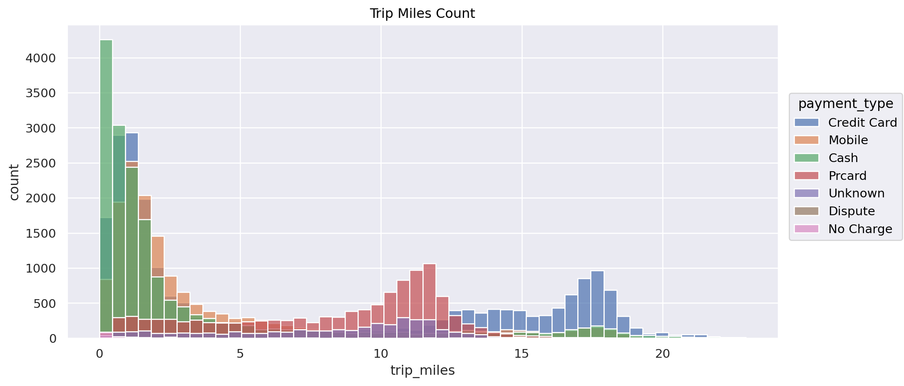
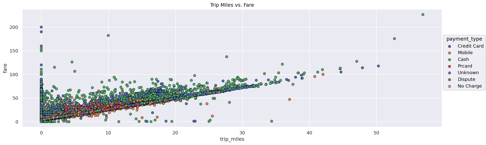
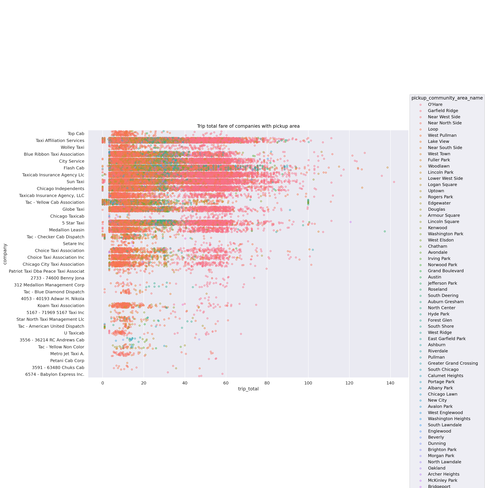
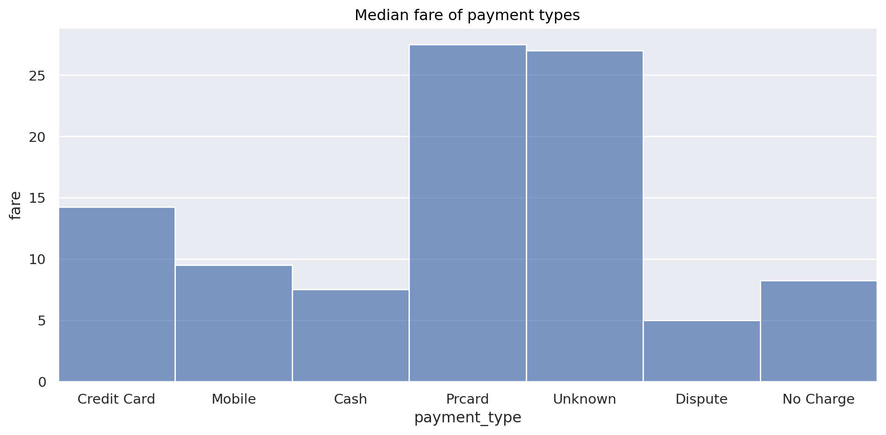
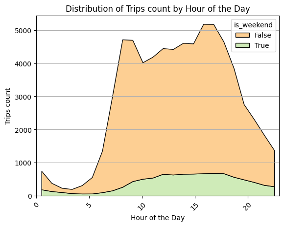

# Cubix - data engineer course

This personal project is made in accordance with the cubix data engineer course, and it's main goals are:
* Learn the basics of **python**
* Learn **web scraping**
* Learn **pandas** and **AWS lambda** through data gathering and processing tasks
* Learn **AWS Glue** for ETL tasks
* Learn **AWS Athena** for querying data
* Learn **Jupyter notebook** for data visualization and analysis

## Project description
The project is divided into 3 main parts:
1. Data extraction from the **Open Meteo API** and **Chicago taxi trips API**, and storing it in **AWS S3**
2. Data processing with **AWS Glue**, and storing it in **AWS S3**
3. Data analysis with **Jupyter notebook**, where we use **Pandas** for data manipulation and **Seaborn** for visualizations

## Technologies used:
* Python 3.8+
* AWS Lambda
* AWS Glue
* AWS Athena
* Data visualization with **Seaborn**

The lambda functions were used for extracting/transforming/loading API data, they can be found in src/notebooks 09-12

## Python libraries used:
**Pandas** for data processing,\
**Matplotlib**, **Seaborn** for data visualizations

## API's used:
* Open meteo weather API - https://archive-api.open-meteo.com/v1/era5
* Chicago data portal API for taxi trips data - 
https://data.cityofchicago.org

## Environmental variables for running 08_local_visualizations.ipynb
* AWS_ACCESS_KEY
* AWS_SECRET_KEY

They are needed to load data from AWS S3 

## Chicago taxi trips data visualization examples 
Trip miles count, broken down by payment type

Correlation of trip_miles and fares, with payment types in colors:

Trip total fare of companies with pickup community area colored:

Median fare of payment types

Distribution of trips count by hour of the day
